# Doc-to-Text Report: LangGraph 기반 멀티 에이전트 시스템

## 프로젝트 개요

PDF 문서에 대해 **최적의 파싱 전략을 자동으로 선택**하고, 그 과정과 결과를 상세히 리포팅하는 LangGraph 기반 멀티 에이전트 시스템입니다.

### 핵심 목표
- 문서별로 최적의 파싱 도구/전략 선택
- 4단계 에이전트 파이프라인 (다중추출 → 검증+폴백 → LLM 평가 → 리포트)
- Solar LLM 기반 유효성 검증 및 품질 평가
- 상세한 리포트 생성 (JSON, CSV)

### 주요 특징
- **5개 도구 동시 추출**: 로컬 라이브러리 3개 + Upstage API 2개
- **페이지 샘플링**: 전체 페이지 중 랜덤 5페이지 추출 (5페이지 미만은 전체)
- **LLM 기반 검증**: Solar API를 통한 텍스트 품질 검증 (Pass/Fail)
- **지능형 폴백**: 실패 시 자동으로 다양한 도구 조합 시도
- **비용 추적**: Upstage API 사용 시 페이지당 비용 자동 계산
- **타임스탬프 저장**: 실행마다 고유한 CSV 파일 생성

---

## 🏗️ 멀티 에이전트 시스템 구조도

```mermaid
graph TB
    Start([PDF 문서 입력]) --> Agent1
    
    subgraph Stage1["1단계: 기본 추출 Agent"]
        Agent1[BasicExtractionAgent]
        Tool1[PDFPlumber<br/>무료]
        Tool2[PDFMiner<br/>무료]
        Tool3[PyPDFium2<br/>무료]
        Tool4[Upstage OCR API<br/>$0.0015/page]
        Tool5[Upstage Document Parse<br/>$0.01/page]
        
        Agent1 --> Tool1
        Agent1 --> Tool2
        Agent1 --> Tool3
        Agent1 --> Tool4
        Agent1 --> Tool5
    end
    
    Tool1 --> Agent2
    Tool2 --> Agent2
    Tool3 --> Agent2
    Tool4 --> Agent2
    Tool5 --> Agent2
    
    subgraph Stage2["2단계: 유효성 검증 Agent"]
        Agent2[ValidationAgent<br/>Solar LLM]
        Decision{페이지별<br/>Pass/Fail?}
        Fallback[폴백 도구 적용]
        FB1[Custom Split]
        FB2[Layout Reorder]
        FB3[Table Enhancement]
        
        Agent2 --> Decision
        Decision -->|Fail| Fallback
        Fallback --> FB1
        Fallback --> FB2
        Fallback --> FB3
        FB1 --> Agent2
        FB2 --> Agent2
        FB3 --> Agent2
    end
    
    Decision -->|Pass| Agent3
    
    subgraph Stage3["3단계: LLM Judge Agent"]
        Agent3[JudgeAgent<br/>Solar pro2]
        Score[0-100점 평가<br/>S_read, S_sent,<br/>S_noise, S_table, S_fig]
        
        Agent3 --> Score
    end
    
    Score --> Agent4
    
    subgraph Stage4["4단계: 리포트 생성 Agent"]
        Agent4[ReportGenerator]
        Report1[judge_report.json]
        Report2[page_level_results.csv]
        Report3[final_selection.csv]
        
        Agent4 --> Report1
        Agent4 --> Report2
        Agent4 --> Report3
    end
    
    Report1 --> End([최종 리포트])
    Report2 --> End
    Report3 --> End
    
    style Agent1 fill:#e1f5ff
    style Agent2 fill:#fff4e1
    style Agent3 fill:#ffe1f5
    style Agent4 fill:#e1ffe1
    style Tool4 fill:#ffd700
    style Tool5 fill:#ffd700
```



### 데이터 흐름

```
📄 PDF 입력
    ↓
┌─────────────────────────────────────────────────────────┐
│ 1단계: 5개 도구로 동시 추출 (페이지 샘플링)             │
│  • pdfplumber ($0)                                      │
│  • pdfminer ($0)                                        │
│  • pypdfium2 ($0)                                       │
│  • upstage_ocr ($0.0015/page)                           │
│  • upstage_document_parse ($0.01/page)                  │
└─────────────────────────────────────────────────────────┘
    ↓ (5개 추출 결과)
┌─────────────────────────────────────────────────────────┐
│ 2단계: Solar LLM 검증 (페이지별 Pass/Fail)              │
│  Pass → 3단계로                                         │
│  Fail → 폴백 도구 적용 → 재검증                        │
│    • Custom Split (PDF 전처리)                          │
│    • Layout Reorder (레이아웃 재정렬)                   │
│    • Table Enhancement (표 구조 개선)                   │
└─────────────────────────────────────────────────────────┘
    ↓ (Pass된 페이지)
┌─────────────────────────────────────────────────────────┐
│ 3단계: Solar LLM Judge (0-100점 평가)                   │
│  • S_read, S_sent, S_noise, S_table, S_fig → S_total   │
│  • 최고 점수 전략 선택 (동점 시 속도 우선)              │
└─────────────────────────────────────────────────────────┘
    ↓ (최종 선택 전략)
┌─────────────────────────────────────────────────────────┐
│ 4단계: 리포트 생성                                       │
│  • judge_report.json (상세 평가)                        │
│  • page_level_results_YYYYMMDD_HHMMSS.csv (페이지별)    │
│  • final_selection_YYYYMMDD_HHMMSS.csv (최종 선택)      │
└─────────────────────────────────────────────────────────┘
    ↓
📊 최종 리포트 출력
```

---

## 시스템 흐름

#### 1단계: 기본 추출 (Multi-Tool Extraction)
- **도구**: 
  1. **PDFPlumber** (로컬, 무료) - 표 추출 우수
  2. **PDFMiner** (로컬, 무료) - 레이아웃 분석 정확
  3. **PyPDFium2** (로컬, 무료) - 빠른 속도
  4. **Upstage OCR API** ($0.0015/page) - 이미지 기반 PDF 처리
  5. **Upstage Document Parse API** ($0.01/page) - 문서 구조 인식
- **원칙**: 최소 가공, 원본 충실 저장
- **페이지 샘플링**: 랜덤 5페이지 선택
- **비용 계산**: API 사용 시 자동 계산
- **산출**: 각 도구별 `doc_meta.json`, `pages_text_sampled.jsonl`

#### 2단계: 유효성 검증 + 폴백
- **Solar LLM 기반 검증**: 텍스트의 자연스러움, 읽기 순서, 표 구조 등 종합 평가 (Pass/Fail)
- **검증 항목**:
  - 읽기 순서 정확성
  - 문장 완결성
  - 노이즈 최소화 (헤더/푸터/페이지번호)
  - 표 구조 보존
  - 전체 가독성
- **폴백 도구** (페이지별 Fail 시 자동 적용):
  1. **Custom Split**: PDF 전처리 후 1단계 도구로 재추출 (2단 레이아웃 처리)
  2. **Layout Reorder**: 레이아웃 기반 텍스트 재정렬
  3. **Table Enhancement**: 표 구조 개선
- **폴백 전략**: 
  - LLM이 제안한 도구 우선 적용
  - 단일 도구 시도 (최대 5개)
  - 2개 조합 시도 (최대 10개)
  - 각 시도마다 LLM 재검증
- **산출**: 검증된 추출 결과 (Pass된 페이지만 3단계로)

#### 3단계: LLM Judge (품질 평가)
- **대상**: 2단계를 Pass한 전략만 평가 (Fail 전략 제외)
- **평가 축** (각 0-100점):
  - S_read (25%): 읽기 순서 정확성
  - S_sent (25%): 문장 완결성
  - S_noise (20%): 노이즈 최소화
  - S_table (20%): 표 파싱 정확성
  - S_fig (10%): 그림/캡션 처리
  - **S_total**: 가중 평균 종합 점수
- **등급 기준**:
  - 85점 이상: pass 등급
  - 70-84점: borderline 등급
  - 70점 미만: fail 등급
- **선정 전략**: 
  1. S_total 최우선 (pass 등급 우선)
  2. 동점 시 처리 속도 고려 (80% 점수 + 20% 속도)
- **산출**: `judge_report.json`, 최종 선택 리포트

#### 4단계: 리포트 생성
- **judge_report.json**: 상세 평가 내역 (페이지별 결과 포함)
- **page_level_results_YYYYMMDD_HHMMSS.csv**: 페이지별 상세 결과
  - 파일명, 페이지 번호
  - OCR/전략, 텍스트 미리보기
  - 유효성 Pass/Fail
  - LLM Judge 점수 (S_read, S_sent, S_noise, S_table, S_total)
  - 처리 시간, 추출 비용(USD), 폴백 경로
  - 페이지별 최선 선택 (1/0)
- **final_selection_YYYYMMDD_HHMMSS.csv**: 문서별 최종 선택 전략
- **타임스탬프**: 실행마다 고유한 파일명으로 저장되어 이전 결과 보존

---

## 주요 기능

### 1. 기본 추출 (Basic Extraction Agent)
- **5개 도구 동시 추출**:
  - **로컬 라이브러리** (무료): PDFPlumber, PDFMiner, PyPDFium2
  - **Upstage API**: OCR API, Document Parse API
- **페이지 샘플링**: 전체 페이지 중 랜덤 5페이지 (5페이지 미만은 전체)
- 페이지별 bbox, 표 데이터 수집
- 최소 가공 원칙 (정렬/교정/헤더 제거 X)
- 각 도구별 독립적인 추출 결과 생성
- **API 비용 자동 계산**: Upstage API 사용 시 페이지당 비용 추적

### 2. 유효성 검증 + 폴백 (Validation Agent)
- **Solar LLM 기반 검증**: 페이지별 텍스트 품질 평가 (Pass/Fail)
  - 읽기 순서 정확성
  - 문장 완결성
  - 노이즈 최소화
  - 표 구조 보존
  - 전체 가독성
- **폴백 도구**:
  - **Custom Split**: PDF 전처리 → 1단계 도구로 재추출 (2단 레이아웃)
  - **Layout Reorder**: 레이아웃 기반 텍스트 재정렬
  - **Table Enhancement**: 표 구조 개선
- **자동 재시도**: Fail 시 단일 도구 → 2개 조합 순차 적용 후 재검증

### 3. LLM Judge (Judge Agent)
- **Upstage Solar pro2** 기반 품질 평가 (Pass된 전략만 평가)
- **5개 축 점수화** (각 0-100점):
  - S_read: 읽기 순서 정확성
  - S_sent: 문장 완결성
  - S_noise: 노이즈 최소화
  - S_table: 표 파싱 정확성
  - S_fig: 그림/캡션 처리
- **종합 점수 (S_total)** 기반 최종 선택
  - 85점 이상: pass 등급
  - 70-84점: borderline 등급
  - 70점 미만: fail 등급
- **선정 전략**: S_total 최우선 → 동점 시 처리 속도 고려

### 4. 리포트 생성 (Report Generator)
- **judge_report.json**: 상세 평가 내역 (페이지별 결과 포함)
- **page_level_results_YYYYMMDD_HHMMSS.csv**: 페이지별 상세 결과
- **final_selection_YYYYMMDD_HHMMSS.csv**: 문서별 최종 선택 전략
- **타임스탬프**: 실행마다 고유한 파일명으로 저장되어 이전 결과 보존

---

## 폴더 구조

```
agentserver/
├── data/
│   ├── input/              # PDF 입력 파일
│   └── output/
│       ├── extracted/      # 추출 결과 (도구별)
│       │   └── temp/       # Custom Split 임시 파일
│       ├── reports/        # judge_report.json
│       └── tables/         # CSV 리포트 (타임스탬프 포함)
├── agents/
│   ├── basic_extraction_agent.py    # 다중 도구 추출
│   ├── validation_agent.py          # LLM 검증 + 폴백
│   ├── judge_agent.py               # LLM 품질 평가
│   └── report_generator.py          # 리포트 생성
├── tools/
│   ├── pdfplumber_tool.py           # PDFPlumber 추출
│   ├── pdfminer_tool.py             # PDFMiner 추출
│   ├── pypdfium2_tool.py            # PyPDFium2 추출
│   ├── upstage_ocr_tool.py          # Upstage OCR API
│   ├── upstage_document_parse_tool.py  # Upstage Document Parse API
│   ├── custom_split_tool.py         # 2단 레이아웃 분할
│   ├── layout_parser_tool.py        # 레이아웃 재정렬
│   └── table_enhancement_tool.py    # 표 강화
├── utils/
│   ├── llm_client.py       # Solar API 클라이언트
│   ├── metrics.py          # 유효성 검증 메트릭 (참고용)
│   └── file_utils.py
├── prompts/
│   ├── validation_prompts.py        # 2단계 검증 프롬프트
│   └── judge_prompts.py             # 3단계 평가 프롬프트
├── state.py                # LangGraph 상태 정의
├── config.py               # 설정 (API키, 임계값, 비용 등)
├── graph.py                # LangGraph 워크플로우
├── main.py                 # 실행 진입점
├── requirements.txt        # 의존성 패키지
└── README.md
```

---

## 설치 및 실행

### 1. 환경 설정

```bash
# 가상환경 생성 (선택)
python -m venv venv
venv\Scripts\activate  # Windows
source venv/bin/activate  # Linux/Mac

# 의존성 설치
pip install -r requirements.txt
```

**주요 의존성:**
- `langgraph`: 멀티 에이전트 워크플로우
- `pdfplumber`, `pdfminer.six`, `pypdfium2`: PDF 추출 라이브러리
- `PyMuPDF (fitz)`: PDF 렌더링 및 레이아웃 분석
- `opencv-python`: 이미지 처리 (Custom Split)
- `requests`: API 통신 (Solar, Upstage)
- `python-dotenv`: 환경 변수 관리

### 2. 환경 변수 설정

`.env` 파일을 생성하고 API 키를 설정하세요:

```bash
SOLAR_API_KEY=your_upstage_api_key_here
```

**중요**: 하나의 API 키로 모든 Upstage 서비스 사용:
- Solar LLM (Validation, Judge)
- Upstage OCR API
- Upstage Document Parse API

API 키는 [Upstage Console](https://console.upstage.ai/)에서 발급받을 수 있습니다.

### 3. 입력 파일 배치

`data/input/` 폴더에 PDF 파일을 배치합니다.
- 한글 파일명 지원
- 다양한 PDF 레이아웃 지원 (단일 컬럼, 2단 레이아웃 등)

### 4. 실행

```bash
# 기본 실행 (data/input/ 폴더의 모든 PDF 처리)
python main.py

# 특정 파일 지정
python main.py --input data/input/example.pdf
```

**실행 흐름:**
1. 입력 PDF 로드 및 페이지 샘플링 (5페이지)
2. 5개 도구로 동시 추출 (로컬 3개 + Upstage API 2개)
3. 페이지별 LLM 검증 (Pass/Fail)
4. Fail 페이지에 대해 폴백 도구 적용 및 재검증
5. Pass된 페이지에 대해 LLM Judge 품질 평가
6. 최종 전략 선택 및 리포트 생성

---

## 설정 (config.py)

### API 설정
```python
# Solar API (Upstage)
SOLAR_API_KEY = os.getenv("SOLAR_API_KEY")
SOLAR_API_BASE = "https://api.upstage.ai/v1"
SOLAR_MODEL = "solar-pro2"

# Upstage API 비용 (per page)
UPSTAGE_API_PRICING = {
    "upstage_ocr": 0.0015,           # $0.0015 per page
    "upstage_document_parse": 0.01,  # $0.01 per page
    "pdfplumber": 0.0,               # 오픈소스 (무료)
    "pdfminer": 0.0,                 # 오픈소스 (무료)
    "pypdfium2": 0.0                 # 오픈소스 (무료)
}
```

### 페이지 샘플링
```python
MAX_PAGES_SAMPLE = 5  # 최대 샘플링 페이지 수
```

### 폴백 설정
```python
MAX_FALLBACK_ATTEMPTS = 2  # 각 축별 최대 재시도 횟수
MIN_IMPROVEMENT_DELTA = 0.1  # 최소 개선폭

FALLBACK_PRIORITY = [
    "custom_split",      # 1. 좌우 분할 (PDF 전처리 후 재추출)
    "layout_reorder",    # 2. 레이아웃 재정렬
    "table_enhancement"  # 3. 표 강화
]
```

### 검증 임계값 (Stage 2: LLM Validation)
```python
VALIDATION_THRESHOLDS = {
    "reading_order": 0.5,    # Pass/Fail 기준
    "sentence_integrity": 0.5,
    "noise_removal": 0.5,
    "table_parsing": 0.5
}
```

### LLM Judge 설정 (Stage 3)
```python
# 평가 가중치
JUDGE_WEIGHTS = {
    "S_read": 0.25,   # 25% - 읽기 순서
    "S_sent": 0.25,   # 25% - 문장 완결성
    "S_noise": 0.20,  # 20% - 노이즈 제거
    "S_table": 0.20,  # 20% - 표 파싱
    "S_fig": 0.10     # 10% - 그림/캡션
}

# 점수 임계값 (0-100)
SCORE_THRESHOLDS = {
    "pass": 85,        # 85점 이상
    "borderline": 70   # 70-84점
}

# 선정 가중치
SELECTION_WEIGHTS = {
    "score": 0.8,    # 80% - S_total 점수
    "speed": 0.2     # 20% - 처리 속도
}
```

---

## 출력 예시

### 1. judge_report.json (상세 평가 리포트)
```json
{
  "document_name": "example.pdf",
  "timestamp": "2025-01-02T14:35:22",
  "doc_meta": {
    "total_pages": 50,
    "sampled_pages": [5, 12, 23, 34, 45]
  },
  "extraction_results": [
    {
      "strategy": "pdfplumber",
      "extraction_cost_usd": 0.0,
      "page_results": [...]
    },
    {
      "strategy": "upstage_document_parse",
      "extraction_cost_usd": 0.05,
      "page_results": [...]
    }
  ],
  "validation_results": [...],
  "judge_results": [
    {
      "strategy": "upstage_document_parse",
      "S_total": 95.2,
      "grade": "pass"
    }
  ],
  "final_selection": {
    "selected_strategy": "upstage_document_parse",
    "S_total": 95.2,
    "extraction_cost_usd": 0.05
  }
}
```

### 2. page_level_results_20250102_143522.csv (페이지별 상세)
| 파일 이름 | 페이지 번호 | OCR/전략 | 텍스트 미리보기 | 유효성 Pass | S_total | 처리 시간(ms) | 추출 비용(USD) | 페이지별 최선 선택 |
|----------|-----------|---------|---------------|------------|---------|-------------|--------------|----------------|
| example.pdf | 5 | pdfplumber | 초보 투자자를... | ✅ | 88.3 | 350.6 | $0.0000 | 0 |
| example.pdf | 5 | upstage_ocr | 초보 투자자를... | ✅ | 92.5 | 700.0 | $0.0015 | 0 |
| example.pdf | 5 | upstage_document_parse | 초보 투자자를... | ✅ | 95.2 | 840.0 | $0.0100 | 1 |

### 3. final_selection_20250102_143522.csv (최종 선택)
| 파일 이름 | 최종 선정 전략 | S_total | OCR 속도(ms/쪽) | 추출 비용(USD) | 선정 근거 |
|----------|--------------|---------|---------------|--------------|---------|
| example.pdf | upstage_document_parse | 95.2 | 840 | $0.0500 | S_total 95.2/100 (최고 품질) |

---

## 💰 비용 계산

### 페이지당 비용
- **pdfplumber**: $0 (무료)
- **pdfminer**: $0 (무료)
- **pypdfium2**: $0 (무료)
- **upstage_ocr**: $0.0015/page
- **upstage_document_parse**: $0.01/page

### 5페이지 처리 예상 비용
- **오픈소스 3개 도구**: $0
- **upstage_ocr**: $0.0075 (5 × $0.0015)
- **upstage_document_parse**: $0.0500 (5 × $0.01)
- **Solar LLM** (Validation + Judge): 별도 토큰 비용 발생

### 비용 최적화 전략
1. **무료 도구 우선**: 오픈소스가 충분히 좋은 품질이면 선택
2. **페이지 샘플링**: 전체가 아닌 5페이지만 처리로 비용 절감
3. **API 선택적 사용**: 필요시에만 Upstage API 활성화

---

## 주요 개념

### LangGraph 상태 관리
- `DocumentState`: 전체 파이프라인의 상태를 관리하는 TypedDict
- 각 에이전트는 상태를 읽고 업데이트
- 페이지별 결과를 `List[PageExtractionResult]`, `List[PageValidationResult]`, `List[PageJudgeResult]`로 관리

### Solar LLM 역할 분리
- **2단계 (Validation)**: 페이지별 텍스트 품질 검증 (Pass/Fail + 신뢰도)
  - 읽기 순서, 문장 완결성, 노이즈, 표 구조, 가독성 종합 평가
  - LLM이 직접 도구 제안 (예: "좌우 분할 필요", "레이아웃 재정렬 권장")
- **3단계 (Judge)**: Pass된 전략만 상세 점수 평가 (0-100점)
  - 5개 축별 세밀한 점수화 및 근거 제시
  - Fail 전략은 평가하지 않음

### Upstage API 통합
- **OCR API**: 이미지 기반 PDF도 처리 가능
- **Document Parse API**: 문서 구조 인식 및 고급 파싱
- **동일한 플로우**: 로컬 도구와 동일하게 Validation → Judge 거침
- **비용 추적**: 페이지당 비용 자동 계산 및 리포트 포함

### 폴백 메커니즘
1. **Custom Split 특별 처리**: PDF 전처리 → 1단계 도구로 재추출
   - 전체 PDF를 좌우 분할
   - 원본 도구(pdfplumber/pdfminer/pypdfium2)로 재추출
   - 페이지별 재검증
2. **일반 도구**: 페이지 단위 텍스트 후처리
   - Layout Reorder: 레이아웃 기반 재정렬
   - Table Enhancement: 표 구조 개선
3. **조합 전략**:
   - 단일 도구 시도 (최대 5개)
   - 2개 조합 시도 (최대 10개)
   - LLM 제안 도구 우선 적용

### 다중 도구 전략
- 1단계에서 5개 도구 동시 추출 → 다양한 초기 조합 생성
- 각 도구의 강점:
  - **PDFPlumber**: 표 추출 우수, 무료
  - **PDFMiner**: 레이아웃 분석 정확, 무료
  - **PyPDFium2**: 빠른 속도, 무료
  - **Upstage OCR**: 이미지 PDF 처리, 유료
  - **Upstage Document Parse**: 구조 인식 고급 파싱, 유료

---

## 테스트

### 시스템 체크
```bash
python test_setup.py
```

### PDF 텍스트 레이어 확인
```bash
python test_pdf_text_layer.py data/input/example.pdf
```

### 그래프 시각화
```bash
python graph.py
```

---

## 라이센스

MIT License

---

## 참고 문서

- [Upstage Solar API](https://developers.upstage.ai/)
- [Upstage OCR API](https://developers.upstage.ai/docs/apis/ocr)
- [Upstage Document Parse API](https://developers.upstage.ai/docs/apis/document-parse)
- [LangGraph Documentation](https://python.langchain.com/docs/langgraph)
- [PDFPlumber](https://github.com/jsvine/pdfplumber)
- [PDFMiner.six](https://github.com/pdfminer/pdfminer.six)
- [PyPDFium2](https://github.com/pypdfium2-team/pypdfium2)

---

## 기여 및 문의

이슈 및 PR을 환영합니다.
프로젝트 관련 문의사항은 이슈로 등록해주세요.
